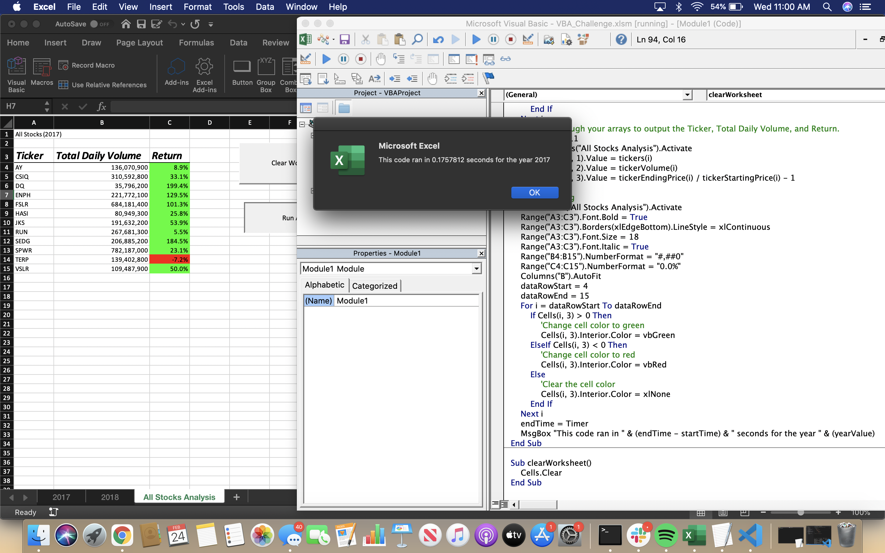
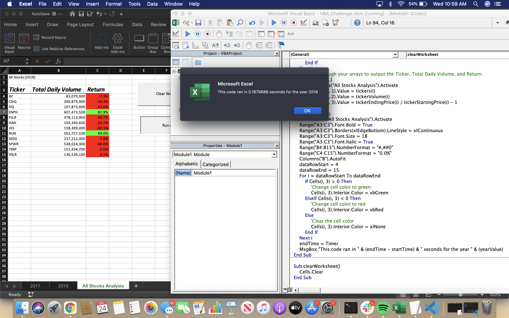

# stock-analysis
Written with VBA
---

# **Overview of Project:**

This analysis was created in order to help Steve's parents better visualize, the returns on various green energy stocks during the years 2017 and 2018.  The table given to us had 3013 rows of data, which to the average eye is a lot of information to read and understand.  

- We created and formatted a table to organize by, stock ticker (name), total daily volume and percent return so that the data would become readable.  All formatting and code was done in the Visual Basic editor.  
- The code allows the user to input the year they wish to see data for, and then outputs a chart as well as a pop up that shows how fast the script was ran.
	
## Refactored code versus Original 
In this challenge we were told to refactor our code in order to run the script faster, and to make the code more concise and effective.  The pop up screens with runTime of the code were used to compare the processing speed of the code before and after refactoring.
- listed below are the files:

	1) [green stocks original file](stock-analysis/green_stocks.xlsm")
	2) [VBA Challenge refactored code](stock-analysis/VBA_Challenge.xlsm)
---
# **Results**

- Data Visualizations:

	1) 
	2) 
	3) 
	4) 

