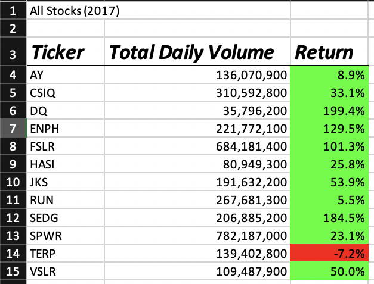
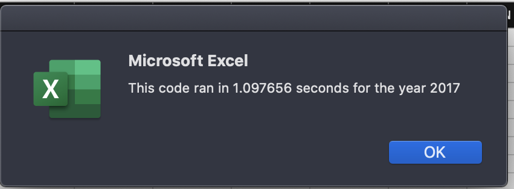
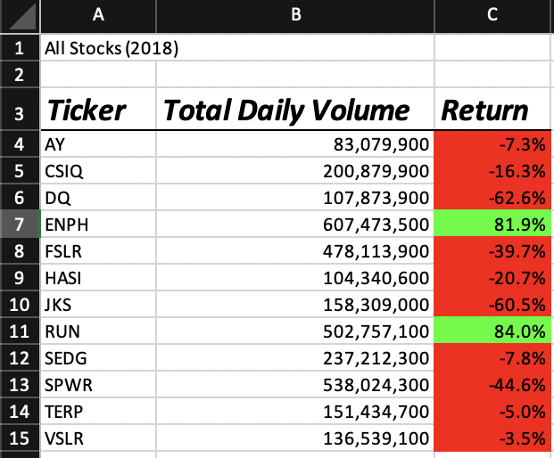
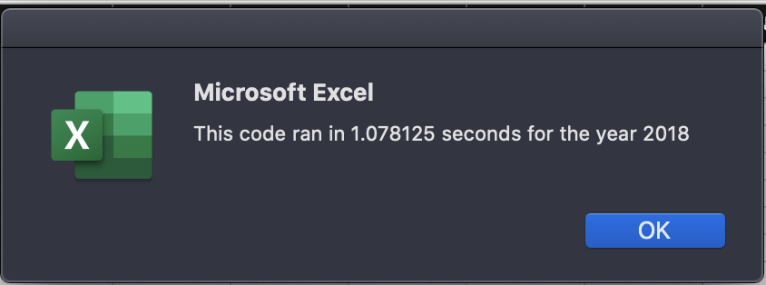

# stock-analysis
Written with VBA
---

# **Overview of Project:**

- This analysis was created in order to help Steve's parents better visualize, the returns on various green energy stocks during the years 2017 and 2018.   At first, they were specifically interested in mapping the returns and total volume of the stock "DQ", which we did analyze individually in the first module.  However, in the Challenge we were asked to analyze all of the green stocks in the data table to see how they fared in 2017 and 2018.

The table given to us had 3013 rows of data, which to the average eye is a lot of information to read and understand.  

- We created and formatted a table to organize by, stock ticker (name), total daily volume and percent return so that the data would become readable.  All formatting and code was done in the Visual Basic editor.  
- The code allows the user to input the year they wish to see data for, and then outputs a chart as well as a pop up that shows how fast the script was ran.

---
# Data Visualizations:

- **Images 2 and 4 are the runtimes before refactoring code**

1) 
2) 
3) 
4) 
---
	
## Refactored code versus Original and why we refactor:

In this challenge we were told to refactor our code in order to run the script faster, and to make the code more concise and effective.  To visually see the difference between our refactored code and original code, we utilized the function; `Timer`.  We then used pop up screens with runTime of the code were used to display the processing speed of the code.
 
- listed below are the files:

	1) [green stocks original code](stock-analysis/green_stocks.xlsm")
	2) [VBA Challenge refactored code](stock-analysis/VBA_Challenge.xlsm)

### Why refactor the code?

Refactoring code has many uses that are extremely important in order to make sure your code is as concise, understandable and effective as possible. 

- **Advantages:**
	1) learning to write concise code leaves little room for bugs and misunderstood/unnecessary functions.
	2) can improve functionality/run time of code
	3) good practice for learning to read and edit code
	4) helps teach alternative methods of completing the same task (get around problems)
- **Disadvantages:**
	1) Can take more time to refactor code
	2) sometime it can lead to new errors
	3) could be confusion between new and old code if you're not organized and careful
---

In our [refactored code](stock-analysis/VBA_Challenge.xlsm) , there were some changes made that allowed our code to run faster.  Below are the changes in run time of the code for both years

- Pre-Refactor:

- Post-Refactor

1) separating the for loops from nested for loops:
- By separating the for loops into two separate loops, we allowed the code to run continuously from beginning to end instead of looping back within the nested loop and then processing the rest of the code.

---
 	
# Results:

## analysis of charts:
- In general, green energy stocks in 2017 had far greater returns than in 2018.

- The **highest** performing stock in 2017 was "DQ"
	* "DQ" fell to -62.6% returns in 2018

- The **highest** performing stock in 2018 was "RUN"
	* "RUN" was returning at a percent of 5.5.% in 2017, and increased its returns to 84.0% in 2018
 
